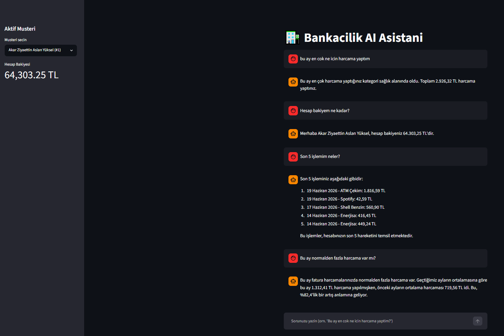

# 🏦 Banking AI Agent

[](http://banking-agent.agreeablewater-e71d04d4.northeurope.azurecontainerapps.io)
[](.github/workflows/deploy.yml)

**🚀 Live Demo:** [banking-agent on Azure](http://banking-agent.agreeablewater-e71d04d4.northeurope.azurecontainerapps.io)

Herhangi bir bankacılık kurumu için kullanılabilecek, [LangGraph](https://www.langchain.com/langgraph)
state machine mimarisiyle çalışan, [Groq](https://groq.com/) üzerinde
gpt-oss-120b (Groq) modelini kullanan konuşma tabanlı bir bankacılık asistanı.
Gerçek müşteri verisi kullanmadan, sentetik olarak üretilmiş hesap ve
işlem kayıtları üzerinden çalışır; kullanıcı doğal dilde soru sorar, agent
bu soruyu SQL/pandas sorgularına çevirip Türkçe, anlaşılır bir yanıt üretir.

Proje, bir agent yazmanın ötesine geçer: uygulama **Docker ile
container'lanmış**, **Azure Container Apps** üzerinde canlıya alınmış ve
**GitHub Actions CI/CD pipeline'ı** ile `main`'e her push'ta otomatik olarak
build edilip deploy edilecek şekilde kurulmuştur.

---

*An LLM-powered conversational banking assistant built on a [LangGraph](https://www.langchain.com/langgraph)
state machine, using gpt-oss-120b via [Groq](https://groq.com/). It runs on
synthetic (Faker-generated) account and transaction data — no real customer
data — turning natural-language questions into SQL/pandas queries and returning
clear answers. Beyond the agent itself, the app is **containerized with Docker**,
**deployed live on Azure Container Apps**, and wired to a **GitHub Actions
CI/CD pipeline** that automatically builds and deploys on every push to `main`.*

## Amaç / Purpose

Bankacılık müşteri hizmetlerinde sıkça sorulan "bakiyem ne kadar?",
"bu ay en çok neye harcadım?", "anormal bir harcama var mı?" gibi soruları,
gerçek zamanlı veri sorgulayan ve niyet bazlı yönlendirme yapan bir AI agent
ile yanıtlamayı gösteren bir referans/demo projesidir. Gerçek banka altyapısı
veya müşteri verisi içermez; tüm veriler `Faker` ile sentetik olarak üretilir.
Mimari, herhangi bir bankanın mevcut müşteri veritabanına entegre edilebilecek
şekilde genel ve kuruma bağımsız tasarlanmıştır.

## System in Action



## Mimari: LangGraph State Machine

Agent, tek bir doğrusal zincir değil, **niyet bazlı koşullu yönlendirme**
yapan bir graph olarak tasarlanmıştır:

```
                 ┌───────────────┐
                 │  parse_intent  │   LLM ile soru sınıflandırılır:
                 │                │   balance / transactions / spending /
                 └───────┬────────┘   anomaly / general + period/category
                         │
                  conditional routing
                  (intent'e göre dallanma)
                         │
       ┌─────────────────┼──────────────────┐
       ▼                 ▼                  ▼
 ┌───────────┐    ┌─────────────┐    ┌───────────┐
 │ query_data │    │  summarize  │    │   alert    │
 │ (bakiye /  │    │ (harcama    │    │ (anomali   │
 │ işlem      │    │  analizi)   │    │  tespiti)  │
 │  listesi)  │    │             │    │            │
 └─────┬──────┘    └──────┬──────┘    └─────┬──────┘
       │                  │                 │
       └──────────────────┼─────────────────┘
                           ▼
                     ┌───────────┐
                     │  respond   │   LLM, sorgu sonucunu doğal
                     │            │   Türkçe yanıta dönüştürür
                     └───────────┘
```

- **parse_intent**: `ChatGroq` (gpt-oss-120b) kullanıcı mesajını
  JSON formatında sınıflandırır — niyet (`intent`), zaman aralığı (`period`:
  bu ay / geçen ay), kategori ve varsa işlem limiti çıkarılır.
- **conditional routing**: `add_conditional_edges` ile, ayrı bir yürütme
  node'u olmadan, sınıflandırılan niyete göre doğrudan `query_data`,
  `summarize`, `alert` veya `general` sorular için `respond`'a yönlendirilir.
- **query_data**: Bakiye veya işlem listesi sorularında `get_account_balance`
  / `get_transactions` tool'larını çalıştırır.
- **summarize**: Harcama analizi sorularında `categorize_spending` ile
  kategori bazlı toplamları hesaplar.
- **alert**: "Anormal harcama var mı?" tipi sorularda `detect_anomaly` ile
  bu ayın kategori harcamalarını önceki ayların ortalamasıyla karşılaştırır.
- **respond**: Elde edilen veriyi LLM ile doğal, kısa bir Türkçe cümleye
  dönüştürür ve sohbet geçmişine ekler.

Kod: [`agent/banking_agent.py`](agent/banking_agent.py)

## Sentetik Veri Yaklaşımı

Gerçek banka verisi kullanılmadığı için [`data/generate_data.py`](data/generate_data.py)
script'i, `Faker('tr_TR')` ile gerçekçi Türkçe isimler kullanarak SQLite
veritabanı (`data/banking.db`) üretir:

- **customers**: 10 müşteri — `customer_id, name, account_balance`
- **transactions**: 500+ işlem (müşteri başına ~55), son 3 aya yayılmış —
  `id, customer_id, date, amount, category, merchant, type`
  - Kategoriler: `market, fatura, restoran, ulaşım, eğlence, sağlık, ATM`
    (+ `maaş` geliri, bakiye tutarlılığı için)
  - Her kategori için gerçekçi merchant listeleri (Migros, Türk Telekom,
    Netflix, Shell vb.)
  - **Bilinçli anomali senaryosu**: bazı müşterilerde bu ay belirli bir
    kategoride geçmiş aylara göre %80-150 daha fazla harcama enjekte edilir,
    böylece "anormal harcama" sorusu test edilebilir gerçek bir veri durumu
    oluşur.

Script tekrar çalıştırılabilir (idempotent) — her seferinde tabloları
DROP & CREATE eder.

## Örnek Sorular

| Soru | Yönlendiği node |
|---|---|
| "Hesap bakiyem ne kadar?" | `query_data` (balance) |
| "Son 5 işlemim neler?" | `query_data` (transactions) |
| "Bu ay en çok ne için harcama yaptım?" | `summarize` (spending) |
| "Geçen ay markete ne kadar harcadım?" | `summarize` (spending + kategori filtresi) |
| "Bu ay normalden fazla harcama var mı?" | `alert` (anomaly) |

## Deployment (Azure Container Apps)

Uygulama container'lanmış ve Azure üzerinde canlıya alınmıştır:

- **Docker**: `Dockerfile` ile Streamlit uygulaması container image'ına
  paketlenir. `.dockerignore` ile `venv/`, `.env`, `.git/` gibi dosyalar
  image dışında tutulur (güvenlik + boyut).
- **Azure Container Registry (ACR)**: Image build edilip özel registry'e
  push edilir.
- **Azure Container Apps**: Image serverless olarak yayına alınır; dışarıya
  açık (`ingress: external`) bir HTTPS URL'i üretilir. `min-replicas 0` ile
  kullanılmadığında sıfıra ölçeklenir (maliyet kontrolü).
- **Secret yönetimi**: `GROQ_API_KEY` image'a gömülmez; Azure Container Apps
  secret'ı olarak runtime'da enjekte edilir.

*The app is containerized with Docker, pushed to Azure Container Registry, and
deployed on Azure Container Apps (external ingress, scale-to-zero). The
`GROQ_API_KEY` is never baked into the image — it is injected at runtime via an
Azure Container Apps secret.*

## CI/CD (GitHub Actions)

`main` dalına her push'ta çalışan otomatik bir pipeline kuruludur
([`.github/workflows/deploy.yml`](.github/workflows/deploy.yml)):

1. **Checkout** — kod çekilir.
2. **Azure login** — bir Azure *service principal* ile giriş yapılır
   (kimlik bilgileri GitHub Secrets içinde `AZURE_CREDENTIALS` olarak tutulur).
3. **Build & push** — Docker image build edilir ve ACR'a push edilir.
4. **Deploy** — Azure Container App yeni image ile güncellenir.

Böylece kod → canlı deployment süreci tamamen otomatiktir; elle deploy komutu
çalıştırmaya gerek kalmaz.

*A GitHub Actions pipeline builds the Docker image, pushes it to Azure Container
Registry, and deploys to Azure Container Apps on every push to `main`, using an
Azure service principal and GitHub Secrets for secure authentication.*

## Proje Yapısı

```
banking-ai-agent/
├── .github/
│   └── workflows/
│       └── deploy.yml       # CI/CD pipeline (build + push + deploy)
├── assets/
│   └── demo_screenshot.png  # Demo ekran görüntüsü
├── data/
│   └── generate_data.py     # Sentetik müşteri/işlem üretici
├── tools/
│   └── query_tools.py       # LangChain tool'ları (SQLite + pandas)
├── agent/
│   └── banking_agent.py     # LangGraph state machine
├── app.py                   # Streamlit chat arayüzü
├── Dockerfile               # Container image tanımı
├── .dockerignore
├── requirements.txt
└── .env.example
```

## Kurulum ve Çalıştırma

### Lokal (Python)

```bash
# 1. Sanal ortam
python -m venv venv
source venv/Scripts/activate   # Windows: venv\Scripts\activate

# 2. Bağımlılıklar
pip install -r requirements.txt

# 3. GROQ_API_KEY'inizi .env dosyasına ekleyin
cp .env.example .env
# .env içine: GROQ_API_KEY=gsk-...

# 4. Sentetik veriyi üret
python data/generate_data.py

# 5. Uygulamayı başlat
streamlit run app.py
```

### Lokal (Docker)

```bash
docker build -t banking-agent .
docker run -p 8501:8501 --env-file .env banking-agent
# http://localhost:8501
```

## Tech Stack

- **LangGraph** — niyet bazlı koşullu yönlendirme yapan state machine
- **LangChain** — tool tanımları
- **Groq (gpt-oss-120b)** — niyet sınıflandırma ve doğal dil yanıt üretimi
- **SQLite + pandas** — sentetik veri saklama ve sorgulama
- **Streamlit** — chat arayüzü
- **Faker** — Türkçe sentetik veri üretimi
- **Docker** — container'lama
- **Azure Container Apps + ACR** — cloud deployment
- **GitHub Actions** — CI/CD pipeline